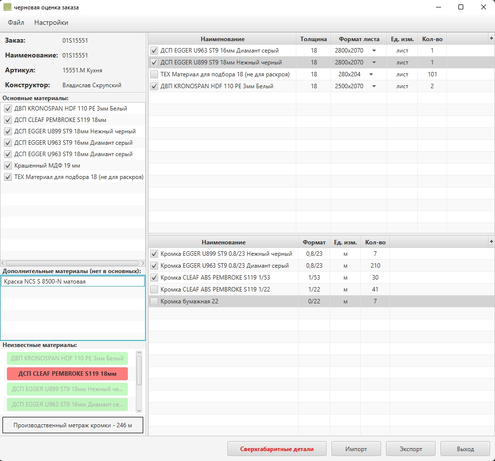
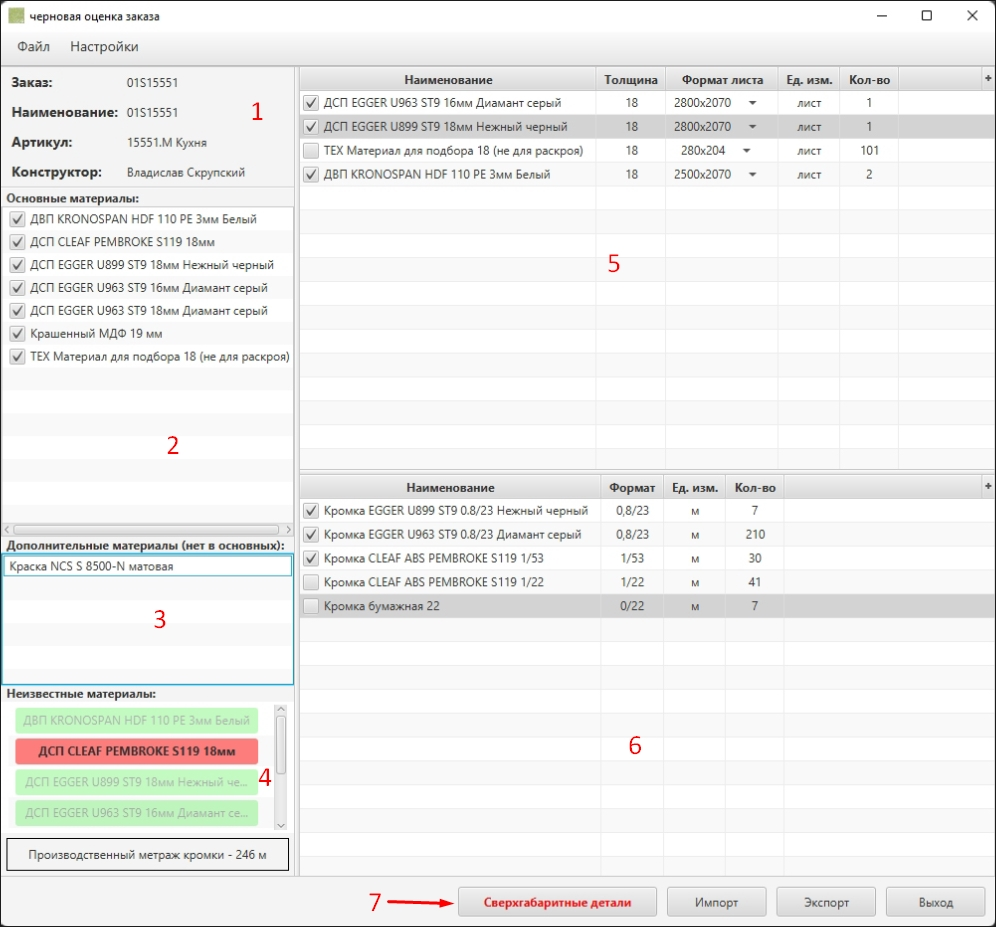
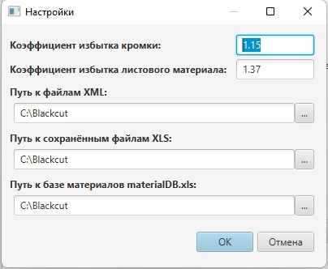
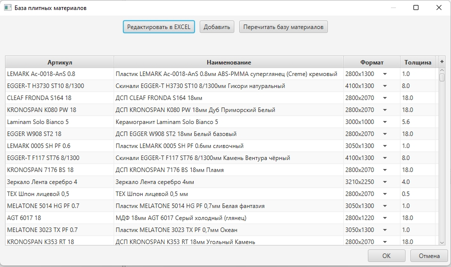
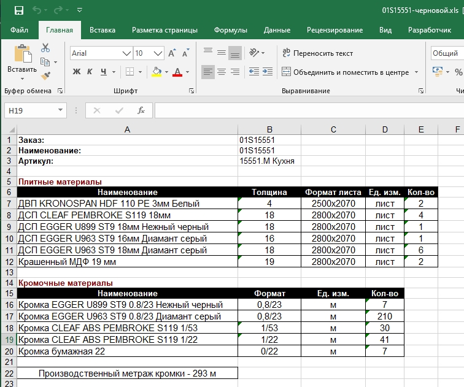

# Technolog Data (BlackcutFromXML)
***
###### Программа разрабатывается и модифицируется под нужды компании, в которой я на данный момент работаю

***
### [Описание](#description)
### [Инструкция](#instruction)
### [Установка](#installation)
### [Планы](#future)
***

## Описание

Программа для черновой оценки заказа. Позволяет на базе сгенерированной спецификации XML из программы Базис-Мебельщик получить количество листов материалов и метраж кромки для бронирования. Также генерируется важный для производственного цеха показатель "общий метраж кромки в заказе".

***

## Инструкция

Для начала работы с заказом в программе необходимо выгрузить спецификацию XML из программы **Базис-Мебельщик** и импортировать его в программу **BlackcutFromXML**

1. **Поля с данными о заказе**
> Информация о номере заказа и о конструкторе
2. **Лист основных материалов**
> Список основных плитных материалов. **Этот список не содержит вспомогательных материалов!** Дополнительные материалы - это материалы, которые появляются в модели только в составе детали из какого либо основного материала. Нарпример: во всём заказе основной материал ***"ДСП белый 18мм"*** и есть одна деталь, толщина которой дорощена до толщины 28мм с помощью детали из материала ***"ДСП белый 10мм"*** - ***"ДСП белый 10мм"*** в данном случае является дополнительным материалом, зависящим от основного.
> Снимая отметки с чекбоксов напротив материала, отключается его участие в выводе конечной информации.
>> **Если у отключенного основного материала были назначены кромки и дополнительные материалы, то они также перестанут учитываться в конечных данных!!!**
3. **Список дополнительных плитных материалов**
> Содержит все зависимые плитные материалы, невошедшие в основной список.
4. **Неизвестные плитные материалы**
> Содержит список всех плитных материалов, которые отсутсвуют в базе.
>> **Содержащиеся в этом списке материалы отсутствуют в конечной информации о количестве листов материала, так как для них неизвестен формат листа и невозможно рассчитать их количество!**
> Для дальнейшей работы с этими материалами их нужно добавить в базу.
5. **Таблица с выходной информацией о плитных материалах**
> Содержит информацию об оценочном количестве листов материала для бронирования службой снабжения. Снятия метки с чекбокса напротив материала убирает его из экспортируемого списка.
6. **Таблица с выходной информацией о кромочных материалах**
> Содержит информацию о необходимом количестве метров кромки (с запасом на обработку) для бронирования службой снабжения. Снятия метки с чекбокса напротив кромки убирает его из экспортируемого списка.
7. **Сверхгабаритные детали**
> Если в заказе имеются детали, габарит которых превышает габарит листа материала, то программа **BlackcutFromXML** выведет уведомление об этом и сформирует список таких деталей. Список сверхгабаритных деталей можно посмотреть на данную кнопку, а также экспортировать его в .xls файл и передать конструктору для дальнейшего разбирательства.

### Меню настройки программы

В данном меню можно задать коэффициенты для плитных и кромочных материалов, которые увеличивают расчётное количество материалов с модели, а также назначить пути к базе материалов, месту хранения импортируемых .xml файлов и экспортируемых .xls файлов

### Меню работы с базой материалов

В данном меню можно посмотреть содержимое базы материалов, добавить материал или открыть базу в сторонней программе

### Пример экспортируемого файла

***

## Установка

Для работы программы понадобится:
* [___Java SE 18___](https://www.oracle.com/java/technologies/downloads/#java18)

После утановки Java SE 18 создайте папку в любом удобном для вас месте, скопируйте туда файл и запустите:

* [___BlackcutFromXML.exe___](./executable/BlackcutFromXML.exe)

***

## Планы

В ближайших планах:

* вывод метража криволинейной оклейки
